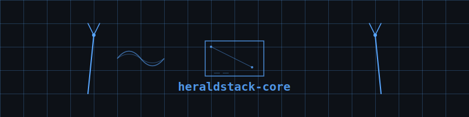

  

# heraldstack-core

Ambient AI infrastructure for multi-platform agent collectives. Four CLI platforms (Claude Code, kiro, goose, Gemini) routed through herald agents, backed by unified knowledge backbone (qdrant vector store, valkey cache), full OpenTelemetry tracing, rust-first application logic.

## status

public

## what this is

- Unified knowledge backbone: qdrant collections (copywriting, writing-inbox, shared-knowledge, prompt-transcripts, agent-memory, shannon-methodology, verbal-ticks)
- Core utilities: JSON schema validation, markdown formatting, naming convention enforcement, JSONL ingestion tooling
- AI entity definitions: nine herald agent personas with Marvel-inspired AI references
- Deployment scripts and validation tools (all new features in Rust, not shell scripts)
- Ethics guidelines, development principles, naming conventions, architecture decision records

## architecture

Four agent platforms (shannon/haunting/gander/ibeji) share knowledge via streaming HTTP to persistent MCP endpoints. Herald routes context to specialists. Qdrant stores chunked embeddings (character-based chunks, HNSW indexing). Valkey caches frequent queries. Jaeger collects OpenTelemetry traces. All application logic written in Rust. Shell scripts limited to deployment orchestration (aws-cli, docker, ci/cd)

## related repos

- `haunting-kiro-cli` — Kiro-cli agent definitions (routes through poltergeist-harald)
- `shannonclaudecodecli` — Claude Code agent definitions (routes through entropy-harald)
- `gandergoosecli` — Goose runtime with Harald identity injection
- `ibeji-gemini-cli` — Gemini CLI research, agent definitions
- `heraldstack-infra` — backing services, persistent MCP endpoints
- `heraldstack-mcp` — launcher scripts, dockerfiles, platform configs
- `heraldstack-cache-proxy` — Rust cache proxy for qdrant

---

built by [bryan chasko](https://github.com/BryanChasko) with the [heraldstack](https://github.com/BryanChasko/heraldstack-core) agent collective
